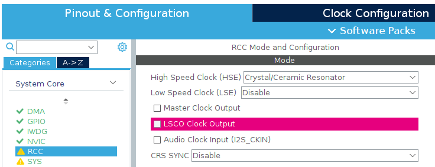
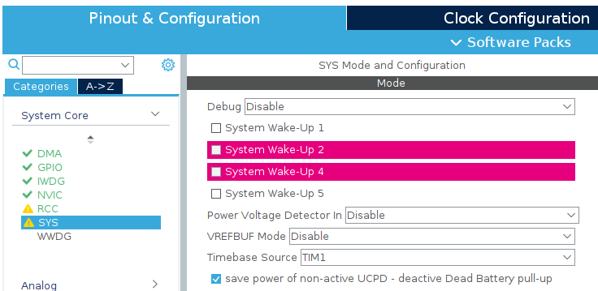
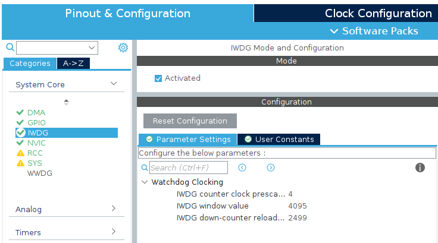
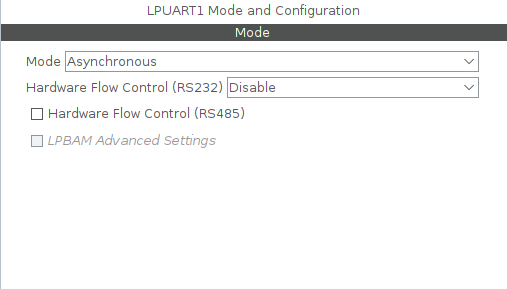
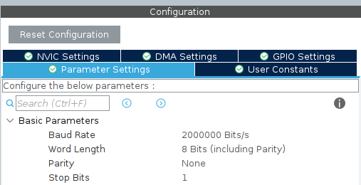
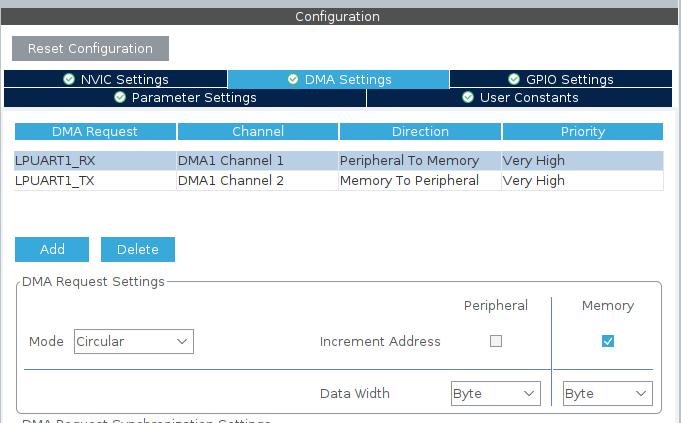
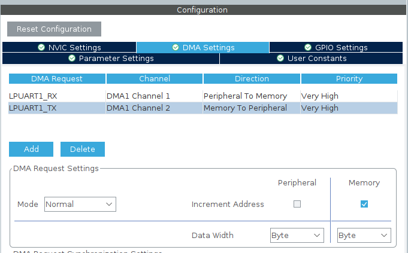
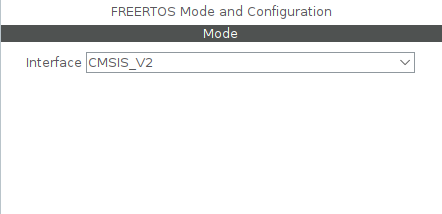
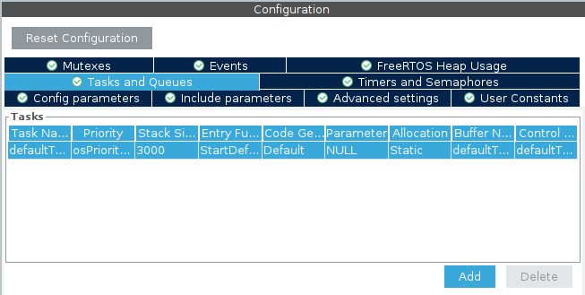
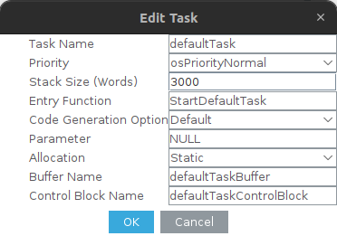

# Micro-ROS-with-Nucleo-board
This project provides a complete guide to setting up Micro-ROS on a Nucleo board. It walks through the steps required to get started, from installing necessary tools to running your first Micro-ROS application.

## Table of Contents
- [Micro-ROS-with-Nucleo-board](#micro-ros-with-nucleo-board)
	- [Table of Contents](#table-of-contents)
	- [Requirement](#requirement)
	- [About choosing UART](#about-choosing-uart)
	- [Step 1 - Install ROS 2](#step-1---install-ros-2)
	- [Step 2 - Install Micro-ROS](#step-2---install-micro-ros)
	- [Step 3 - Download STM32CubeIDE](#step-3---download-stm32cubeide)
	- [Step 4 - Download Docker](#step-4---download-docker)
	- [Step 5 - IOC Setup](#step-5---ioc-setup)
		- [1. Create STM32 Project](#1-create-stm32-project)
		- [2. Setting IOC](#2-setting-ioc)
	- [Step 6 - Clone micro\_ros\_stm32cubemx\_utils](#step-6---clone-micro_ros_stm32cubemx_utils)
	- [Step 7 - CMSIS](#step-7---cmsis)
	- [Step 8 - About Git](#step-8---about-git)
	- [Step 9 - Setting Project's Properties](#step-9---setting-projects-properties)
	- [Step 10 - Add Micro-ROS Code to main.c](#step-10---add-micro-ros-code-to-mainc)
		- [1. Include Libraries](#1-include-libraries)
		- [2. Create Variable](#2-create-variable)
		- [3. Create Functions](#3-create-functions)
		- [4. Add Micro-ROS Codew](#4-add-micro-ros-codew)
	- [Step 11 - Running Micro-ROS](#step-11---running-micro-ros)
	- [Extra](#extra)
	- [Documentation](#documentation)
		- [GitHub Repositories:](#github-repositories)
		- [Installations:](#installations)
		- [Special Thanks:](#special-thanks)
	- [Feedback](#feedback)

## Requirement
Before starting, make sure you have the following:
- A computer with Ubuntu 22.04.4 LTS
- ROS2 installed
- Micro-ROS installed
- STM32CubeIDE installed
- Docker installed
- A USB cable to connect the Nucleo board to your computer
- Nucleo Board

## About choosing UART
To choose the correct UART port, you need to identify which port the microcontroller uses to connect to your computer. You can search for your specific board's datasheet by entering "Your Board Datasheet" on Google. For more detailed information, visit [STMicroelectronics' website](www.st.com) and refer to the user manual document.

## Step 1 - Install ROS 2
To get started, you'll need to install ROS 2 on your system. For this guide, we are using the ROS 2 Humble distribution. Follow the official ROS 2 installation guide for Ubuntu by clicking [here](https://docs.ros.org/en/humble/Installation/Ubuntu-Install-Debs.html).

## Step 2 - Install Micro-ROS
To set up Micro-ROS, Visit the [official Micro-ROS tutorial](https://micro.ros.org/docs/tutorials/core/first_application_linux/) and follow the guide to get started.
```bash
mkdir microros_ws
cd microros_ws

git clone -b $ROS_DISTRO https://github.com/micro-ROS/micro_ros_setup.git src/micro_ros_setup

sudo apt update && rosdep update
rosdep install --from-paths src --ignore-src -y

colcon build
source install/local_setup.bash

ros2 run micro_ros_setup create_firmware_ws.sh host
ros2 run micro_ros_setup build_firmware.sh
source install/local_setup.bash

ros2 run micro_ros_setup create_agent_ws.sh
ros2 run micro_ros_setup build_agent.sh
source install/local_setup.bash
```
To Verify, please run
```bash
ros2 run micro_ros_demos_rclc int32_publisher
ros2 topic list
```

## Step 3 - Download STM32CubeIDE
Visit this youtube video [Install STM32CUBEIDE on Linux(UBUNTU) by Embedded Icon
](https://youtu.be/j3P2rsB_-BY?si=XfH9ioiwhtgmfos6) and follow the guide to install the STM32CubeIDE.

## Step 4 - Download Docker
Visit this youtube video [How to Install Docker on Ubuntu: A Step-By-Step Guide
 by vCloudBitsBytes](https://www.youtube.com/watch?v=cqbh-RneBlk) and follow the guide to install the Docker.

## Step 5 - IOC Setup
### 1. Create STM32 Project
`File` -> `New` -> `STM32 Project` -> `Board Selector`

Type your Commercial Part Number for example NUCLEO-F411RE and click `Next`

Complete the project name then click `Finish`

`Initialize all peripherals with their default Mode?` -> `Yes`

`Device Configuration Tool ...` -> `Yes`

### 2. Setting IOC
- System Core
    - RCC
        - `HSE: Cystal/Ceramic Resonator`
    - SYS
        - `Timebase Source: TIM1`
    - IWDG (Enable if you want auto-reconnect)
        - `Activated`
        - `down-counter reload 2499`







- Connectivity
    - LPUART (Choose preferable baudrate) `Asynchronous`
        - In DMA Settings tab, click Add
            - Add RX - `Mode: Circular` `Priority: Very High`
            - Add TX - `Priority: Very High`
        - In NVIC Settings tab, click enable `global interrupt`






- Middleware
    - FREERTOS `CMSIS_V2`
        - Double click `defaultTask`
            - `Stack Size (Words): 3000`
        - Make sure micro-ROS task has more than 10 kB of stack (1 Word = 4 Bytes)!





Click `Device Configuration Tool Code Generation` or `Gear Icon`

## Step 6 - Clone micro_ros_stm32cubemx_utils
Go to the your project folder in workspace, and then open terminal
```bash
git clone https://github.com/micro-ROS/micro_ros_stm32cubemx_utils.git
cd micro_ros_stm32cubemx_utils
git checkout humble
git branch
```
Next, copy the content from the `extra_sources` folder and paste it into the `core -> src` directory.

In the `microros_transport` directory, delete all files except for `dma_transport.c`.

## Step 7 - CMSIS
If you plan to use CMSIS in your project, please refer to the provided manual and example files in the `CMSIS` folder. These resources will help you integrate CMSIS correctly into your development workflow.

## Step 8 - About Git
Inside your STM32 project, you can ignore the `Debug` and `Release` folders by excluding them from version control.

If you want to push the `micro_ros_stm32cubemx_utils` folder to your own repository, we recommend removing its existing Git history using:
```bash
rm -rf .git*
```

## Step 9 - Setting Project's Properties

- Navigate to `Project -> Settings -> C/C++ Build -> Settings -> Build Steps Tab `
    - In `Pre-build steps` add:
    ```bash
	echo "<your password>" | sudo -S docker pull microros/micro_ros_static_library_builder:humble && echo "<your password>" | sudo -S docker run --rm -v ${workspace_loc:/${ProjName}}:/project --env MICROROS_LIBRARY_FOLDER=micro_ros_stm32cubemx_utils/microros_static_library_ide microros/micro_ros_static_library_builder:humble
    ```
	- or we can add this simplify version:
    ```bash
	echo "<your password>" | sudo -S bash -c 'docker pull microros/micro_ros_static_library_builder:humble && docker run --rm -v /home/transporter/Micro-ROS-with-Nucleo-board/uros_example:/project --env MICROROS_LIBRARY_FOLDER=micro_ros_stm32cubemx_utils/microros_static_library_ide microros/micro_ros_static_library_builder:humble'
    ```
	Note: Replace `<your password>` with your actual Ubuntu sudo password.

- Navigate to `Project -> Settings -> C/C++ Build -> Settings -> Tool Settings Tab -> MCU/MPU GCC Compiler -> Include paths`
```bash
../micro_ros_stm32cubemx_utils/microros_static_library_ide/libmicroros/include
```

- Navigate to `Project -> Settings -> C/C++ Build -> Settings -> MCU/MPU GCC Linker -> Libraries`
    - In Libraries (-l)
    ```bash
    microros 
    ```
    - in Library search path (-L)
    ```bash
    ../micro_ros_stm32cubemx_utils/microros_static_library_ide/libmicroros 
    ```

Finally, right-click the project and select `Build`. At this point, It will take a while, and the build should complete without any errors.

## Step 10 - Add Micro-ROS Code to main.c
### 1. Include Libraries
```c
/* USER CODE BEGIN Includes */
#include <rcl/rcl.h>
#include <rcl/error_handling.h>
#include <rclc/rclc.h>
#include <rclc/executor.h>
#include <uxr/client/transport.h>
#include <rmw_microxrcedds_c/config.h>
#include <rmw_microros/rmw_microros.h>

#include <std_msgs/msg/multi_array_dimension.h>
#include <std_msgs/msg/multi_array_layout.h>
#include <std_msgs/msg/float64_multi_array.h>
#include <geometry_msgs/msg/twist.h>
/* USER CODE END Includes */
```

### 2. Create Variable
```c
/* USER CODE BEGIN PM */
#define RCLSOFTCHECK(fn) if (fn!= RCL_RET_OK){};
/* USER CODE END PM */

/* USER CODE BEGIN PV */
rcl_node_t node;
rclc_support_t support;
rcl_allocator_t allocator;
rcl_init_options_t init_options;
rclc_executor_t executor;

rcl_publisher_t publisher;
rcl_subscription_t subscriber;

std_msgs__msg__Float64MultiArray pub_msg;
geometry_msgs__msg__Twist sub_msg;

rcl_timer_t timer;
const unsigned int timer_period = RCL_MS_TO_NS(10);
const int timeout_ms = 1000;

float linear_x, linear_y, linear_z, angular_x, angular_y, angular_z;
/* USER CODE END PV */
```

### 3. Create Functions
```c
/* USER CODE BEGIN PFP */
bool cubemx_transport_open(struct uxrCustomTransport *transport);
bool cubemx_transport_close(struct uxrCustomTransport *transport);
size_t cubemx_transport_write(struct uxrCustomTransport *transport,
		const uint8_t *buf, size_t len, uint8_t *err);
size_t cubemx_transport_read(struct uxrCustomTransport *transport, uint8_t *buf,
		size_t len, int timeout, uint8_t *err);

void* microros_allocate(size_t size, void *state);
void microros_deallocate(void *pointer, void *state);
void* microros_reallocate(void *pointer, size_t size, void *state);
void* microros_zero_allocate(size_t number_of_elements, size_t size_of_element,
		void *state);

void timer_callback(rcl_timer_t *timer, int64_t last_call_time);
void subscription_callback(const void *msgin);
/* USER CODE END PFP */
```

### 4. Add Micro-ROS Codew
```c
/* USER CODE BEGIN 0 */
void timer_callback(rcl_timer_t *timer, int64_t last_call_time) {
	static uint8_t cnt = 0;

	if (timer != NULL) {
		// Sync micro-ROS session
		rmw_uros_sync_session(timeout_ms);

		// Toggle LED every 50 cycles (approximately every 0.5 seconds)
		if (cnt == 0)
			HAL_GPIO_TogglePin(LD2_GPIO_Port, LD2_Pin);
		cnt = (cnt + 1) % 50;

		// Prepare and publish multi-array message with motor data
		if (pub_msg.data.data != NULL) {
			pub_msg.data.data[0] = linear_x;
			pub_msg.data.data[1] = linear_y;
			pub_msg.data.data[2] = linear_z;
			pub_msg.data.data[3] = angular_x;
			pub_msg.data.data[4] = angular_y;
			pub_msg.data.data[5] = angular_z;

			// Publish the multi-array message
			RCLSOFTCHECK(rcl_publish(&publisher, &pub_msg, NULL));
		}

		// Reinitialize watchdog timer
		HAL_IWDG_Init(&hiwdg);
	}
}

void subscription_callback(const void *msgin) {
	const geometry_msgs__msg__Twist *twist_msg =
			(const geometry_msgs__msg__Twist*) msgin;

	linear_x = twist_msg->linear.x;
	linear_y = twist_msg->linear.y;
	linear_z = twist_msg->linear.z;

	angular_x = twist_msg->angular.x;
	angular_y = twist_msg->angular.y;
	angular_z = twist_msg->angular.z;
}

void StartDefaultTask(void *argument) {

	// micro-ROS configuration
	rmw_uros_set_custom_transport(true, (void*) &hlpuart1,
			cubemx_transport_open, cubemx_transport_close,
			cubemx_transport_write, cubemx_transport_read);

	rcl_allocator_t freeRTOS_allocator =
			rcutils_get_zero_initialized_allocator();
	freeRTOS_allocator.allocate = microros_allocate;
	freeRTOS_allocator.deallocate = microros_deallocate;
	freeRTOS_allocator.reallocate = microros_reallocate;
	freeRTOS_allocator.zero_allocate = microros_zero_allocate;

	if (!rcutils_set_default_allocator(&freeRTOS_allocator)) {
		printf("Error on default allocators (line %d)\n", __LINE__);
	}
	allocator = rcl_get_default_allocator();

	//create init
	init_options = rcl_get_zero_initialized_init_options();
	RCLSOFTCHECK(rcl_init_options_init(&init_options, allocator));
	RCLSOFTCHECK(rcl_init_options_set_domain_id(&init_options, 99));

	//create support
	rclc_support_init_with_options(&support, 0, NULL, &init_options,
			&allocator);

	// create node
	rclc_node_init_default(&node, "uros_motor_node", "", &support);

	pub_msg.layout.dim.capacity = 1;
	pub_msg.layout.dim.size = 1;
	pub_msg.layout.dim.data = malloc(
			sizeof(std_msgs__msg__MultiArrayDimension) * 1);

	pub_msg.layout.dim.data[0].label.data = malloc(10);
	pub_msg.layout.dim.data[0].label.capacity = 10;
	pub_msg.layout.dim.data[0].label.size = strlen("motor_data");
	strcpy(pub_msg.layout.dim.data[0].label.data, "motor_data");

	pub_msg.layout.data_offset = 0;

	pub_msg.data.capacity = 6;
	pub_msg.data.size = 6;
	pub_msg.data.data = malloc(6 * sizeof(double));

	// Create publisher
	rclc_publisher_init_default(&publisher, &node,
			ROSIDL_GET_MSG_TYPE_SUPPORT(std_msgs, msg, Float64MultiArray),
			"robot_pos");

	// Create subscriber
	rclc_subscription_init_best_effort(&subscriber, &node,
			ROSIDL_GET_MSG_TYPE_SUPPORT(geometry_msgs, msg, Twist), "cmd_vel");

	//create timer
	rclc_timer_init_default(&timer, &support, timer_period, timer_callback);

	//create executor
	executor = rclc_executor_get_zero_initialized_executor();
	rclc_executor_init(&executor, &support.context, 2, &allocator); // total number of handles = #subscriptions + #timers + #clients + #service (Should not handle too much)
	rclc_executor_add_timer(&executor, &timer);
	rclc_executor_add_subscription(&executor, &subscriber, &sub_msg,
			&subscription_callback, ON_NEW_DATA);
	rclc_executor_spin(&executor);
}
/* USER CODE END 0 */
```
Then, click `Run` to upload the code to the Nucleo board.
If you get `warning: _gettimeofday is not implemented and will always fail`, please add the following to `syscalls.c`
```c
int _gettimeofday_r(struct _reent *ptr, struct timeval *tv, void *tz) {
    (void)ptr;   // Unused
    (void)tv;    // Unused
    (void)tz;    // Unused
    errno = ENOSYS;  // "Function not implemented"
    return -1;
}
```

## Step 11 - Running Micro-ROS
Grant permission to Docker:
```bash
sudo chmod 666 /var/run/docker.sock
```

Run the Micro-ROS Agent (Change the baud rate to match your configuration):
```bash
ros2 run micro_ros_agent micro_ros_agent serial -b 2000000 --dev /dev/ttyACM0 
```

Check if the agent is running successfully:
```bash
ros2 topic list
```

If you see `/uros_motor_node` in the list, congratulations! You have successfully installed Micro-ROS on the Nucleo board.

If nothing appear, press the reset button.

## Extra
For custom interface, please follow step to create one in [official page](https://docs.ros.org/en/humble/Tutorials/Beginner-Client-Libraries/Custom-ROS2-Interfaces.html) 
Once created, copy the entire custom interface package directory into `micro_ros_stm32cubemx_utils/microros_static_library_ide/library_generation/extra_packages`
Remove the current libmicroros folder to force regeneration `micro_ros_stm32cubemx_utils/microros_static_library_ide/libmicroros/` and rebuild

## Documentation
### GitHub Repositories:
- [micro_ros_setup - Humble](https://github.com/micro-ROS/micro_ros_setup/tree/humble)
- [micro_ros_stm32cubemx_utils - Humble](https://github.com/micro-ROS/micro_ros_stm32cubemx_utils/tree/humble)
- [micro_ros_arduino](https://github.com/micro-ROS/micro_ros_arduino/tree/humble)

### Installations:
- [Install STM32CUBEIDE on Linux (Ubuntu) by Embedded Icon](https://youtu.be/j3P2rsB_-BY?si=XfH9ioiwhtgmfos6)
- [How to Install Docker on Ubuntu: A Step-By-Step Guide by vCloudBitsBytes](https://www.youtube.com/watch?v=cqbh-RneBlk)

### Special Thanks:
Thanks to the following videos that have helped me reach this point:

- [How to Set Up Micro-ROS on Any STM32 Microcontroller by Robotics in a Nutshell](https://www.youtube.com/watch?v=xbWaHARjSmk)
- [Micro-ROS STM32 with STM32CubeIDE by Sokheng Din](https://www.youtube.com/watch?v=bn-P3fxtTF4)

## Feedback
If you have any feedback, please create an issue and I will answer your questions there.